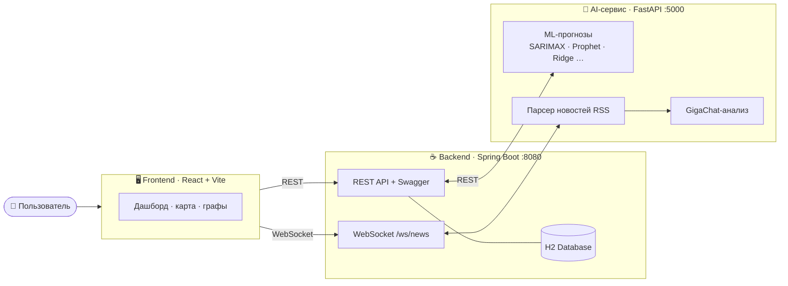
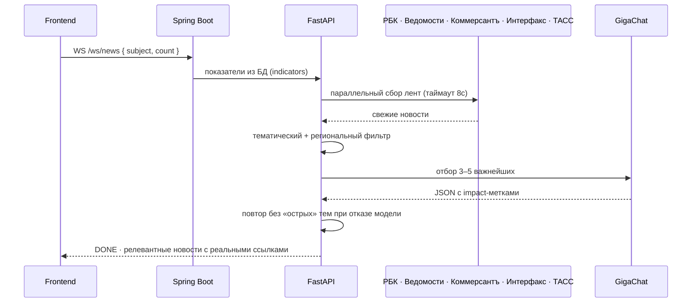

<div align="center">

# 📊 Income Planning Assistant

### Помощник планирования доходов с AI-аналитикой, прогнозами и живой новостной лентой

[](https://openjdk.org/)
[](https://spring.io/projects/spring-boot)
[](https://www.python.org/)
[](https://fastapi.tiangolo.com/)
[](https://react.dev/)
[](https://www.typescriptlang.org/)
[](https://developers.sber.ru/portal/products/gigachat)

</div>

---

## ✨ О проекте

**Income Planning Assistant** — аналитическая платформа для планирования доходов по регионам и отраслям.
Пользователь загружает Excel с историческими данными, а система:

- 🔮 **прогнозирует** показатели несколькими ML-моделями и выбирает лучшую;
- 🧭 строит **дерево бизнес-драйверов** и сценарии «что если»;
- 🚨 находит **аномалии** во временных рядах и предлагает их скорректировать;
- 📰 подтягивает **релевантные новости** из деловых СМИ и ранжирует их по важности через **GigaChat**;
- 📈 показывает всё это в интерактивном дашборде с картой регионов и экспортом в CSV.

---

## 🏗️ Архитектура

Три независимых сервиса, общающихся по HTTP и WebSocket:



| Слой | Стек | Порт | Назначение |
|------|------|:----:|-----------|
| **Frontend** | React 18, TypeScript, Vite, Tailwind, Zustand, Recharts, React Flow | `5173` | Дашборд, карта регионов, дерево драйверов, новостная лента |
| **Backend** | Java 17, Spring Boot 3.3, JPA/H2, WebSocket, Swagger | `8080` | REST/WS API, хранение данных, оркестрация, кеш новостей |
| **AI-сервис** | Python 3.11, FastAPI, scikit-learn, statsmodels, Prophet, GigaChat | `5000` | Прогнозы, парсинг новостей, анализ через GigaChat |

---

## 📰 Новостной пайплайн (GigaChat)

Ключевая фишка — новости не «любые», а **по теме загруженных данных** и отсортированные по важности.



**Что внутри:**
- 🎯 **Тематическая фильтрация** — из названий показателей строятся ключевые префиксы + доменные кластеры (автопром, АПК, общепит, финтех), поэтому данные про автопром находят новости про автопром, а не случайные.
- 🗺️ **Фильтр по региону** — с учётом синонимов (Москва ↔ Подмосковье, Петербург ↔ Питер).
- 🛡️ **Устойчивость к отказам GigaChat** — если модель отказывается анализировать острые темы, запрос автоматически повторяется без них.
- 🔗 **Восстановление ссылок** — реальные URL из RSS подставляются в ответ модели.
- ⚡ **Живые статусы** по WebSocket: `START → INDICATORS → PARSED → FOUND → ANALYZING → DONE`.

---

## 🚀 Быстрый старт

> Нужны: **JDK 17+**, **Python 3.11+**, **Node.js 18+**.

### 1. Backend — Spring Boot

```bash
cd backend
./gradlew bootRun
```
📍 `http://localhost:8080` · Swagger UI: `http://localhost:8080/swagger-ui.html`

### 2. AI-сервис — FastAPI

```bash
cd python-service
pip install -r requirements.txt

# токен для GigaChat
echo "AUTH_TOKEN=<ваш_токен_GigaChat>" > .env

python app.py
```
📍 `http://localhost:5000` · health-check: `http://localhost:5000/health`

### 3. Frontend — React

```bash
cd frontend
npm install
npm run dev
```
📍 `http://localhost:5173`

---

## 🔌 Основные эндпоинты

| Метод | Путь | Описание |
|-------|------|----------|
| `POST` | `/api/upload` | Загрузка Excel с данными |
| `GET` | `/api/indicators` | Список показателей |
| `GET` | `/api/forecast` | Прогноз по показателю (SARIMAX/Prophet/…) |
| `GET` | `/api/seasonality` | Сезонность |
| `GET` | `/api/analytics/drivers` | Дерево бизнес-драйверов |
| `POST` | `/api/scenarios` | Сценарии «что если» |
| `GET`/`POST` | `/api/anomalies/*` | Поиск и коррекция аномалий |
| `GET`/`POST` | `/api/news` | Новости (REST, с кешем) |
| `WS` | `/ws/news` | Новости в реальном времени + AI-анализ |
| `POST` | `/api/ai/summary` | Краткая AI-сводка по региону |
| `GET` | `/api/export/csv` | Экспорт в CSV |

> Полный контракт — в **Swagger UI**.

---

## 🧪 Тестирование новостного модуля

Отдельный скрипт прогоняет весь пайплайн (парсинг → анализ GigaChat) без запуска всего стека:

```bash
cd python-service
python test_news_migration.py > ../gigachat.log 2>&1
```

Логи работы (сбор новостей, ответы GigaChat, итоговый JSON) сохраняются в `gigachat.log`.

---

## 🗂️ Структура репозитория

```
Income-Planning-Assistant/
├── backend/            # Spring Boot: REST/WS API, JPA, оркестрация
│   └── src/main/java/com/example/universityanalytics/
│       ├── controller/ # AnalyticsController — все эндпоинты
│       ├── service/    # NewsService, ForecastService, AnomalyService …
│       └── ...
├── python-service/     # FastAPI: ML-прогнозы + новости + GigaChat
│   ├── app.py                 # эндпоинты /predict, /ws/news, /generate-news
│   ├── news_parser.py         # RSS-парсинг + тематическая фильтрация
│   ├── text_generation.py     # анализ новостей через GigaChat
│   └── ai_prediction.py       # сравнение ML-моделей
└── frontend/           # React + Vite: дашборд
    └── src/domains/    # ai-insights, analytics, scenarios, business-graph …
```

---

## ⚙️ Технологии

**Backend:** Java 17 · Spring Boot 3.3 · Spring Data JPA · H2 · WebSocket · WebFlux · Apache POI · springdoc-openapi
**AI-сервис:** FastAPI · Uvicorn · scikit-learn · statsmodels · Prophet · pandas/numpy · feedparser · GigaChat SDK
**Frontend:** React 18 · TypeScript · Vite · TailwindCSS · Zustand · Recharts · React Flow · react-simple-maps · MSW

---

<div align="center">
Сделано для планирования доходов 💚
</div>
